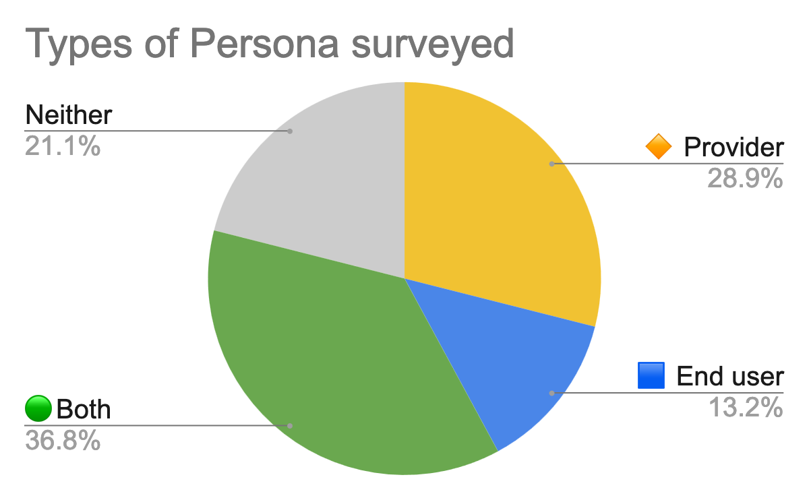
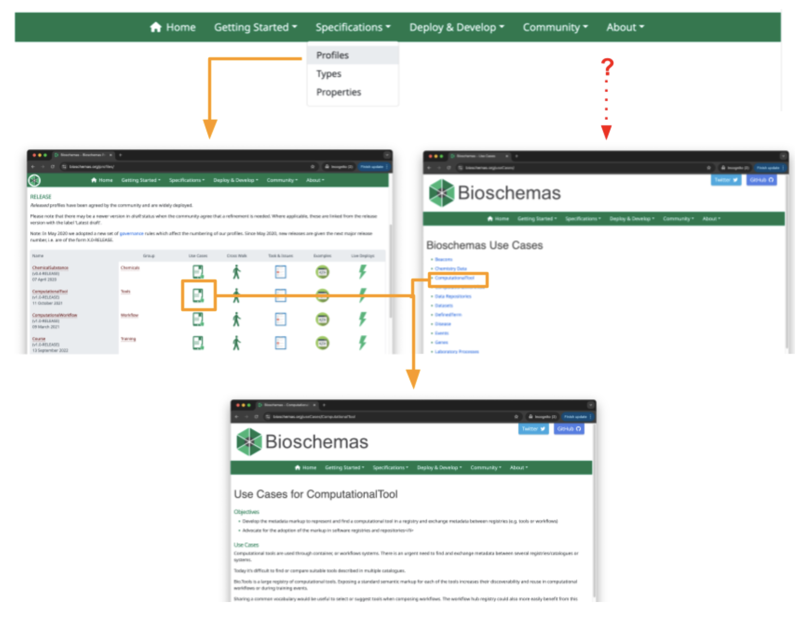
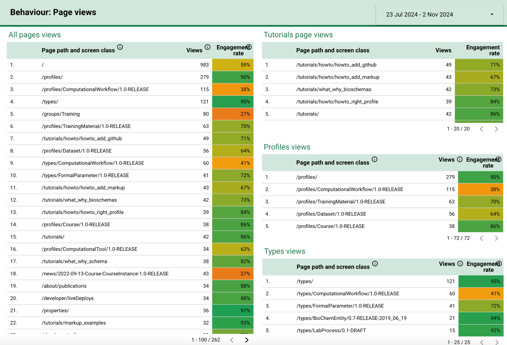
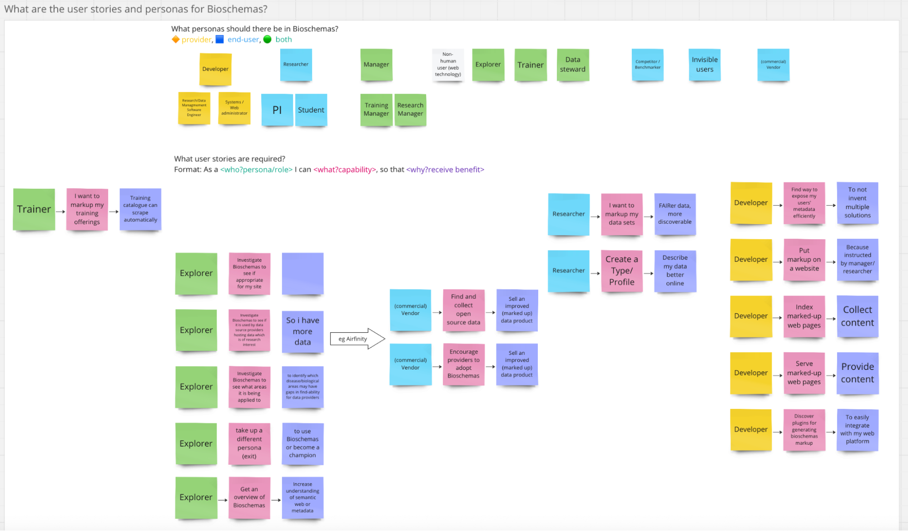
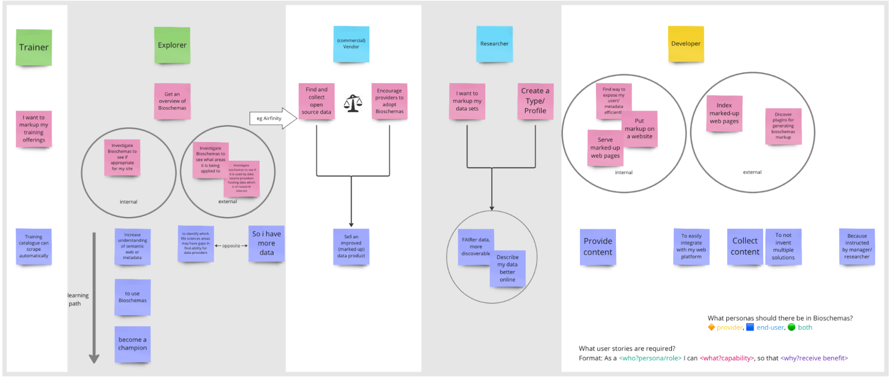
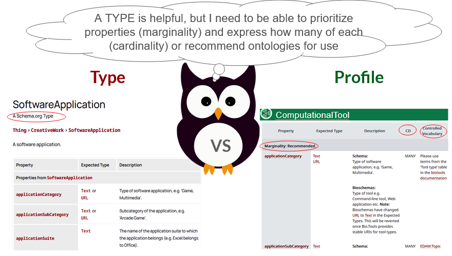
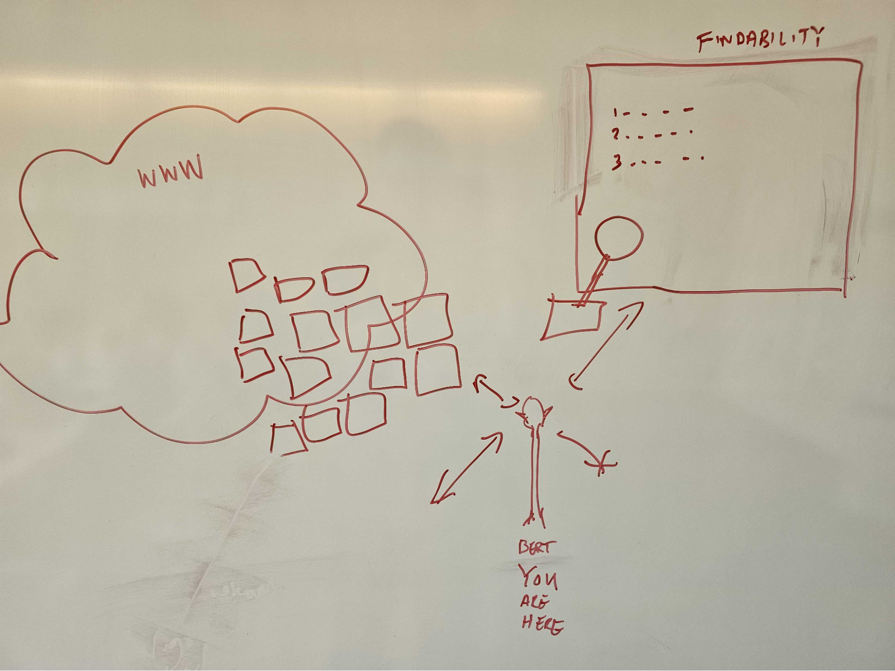
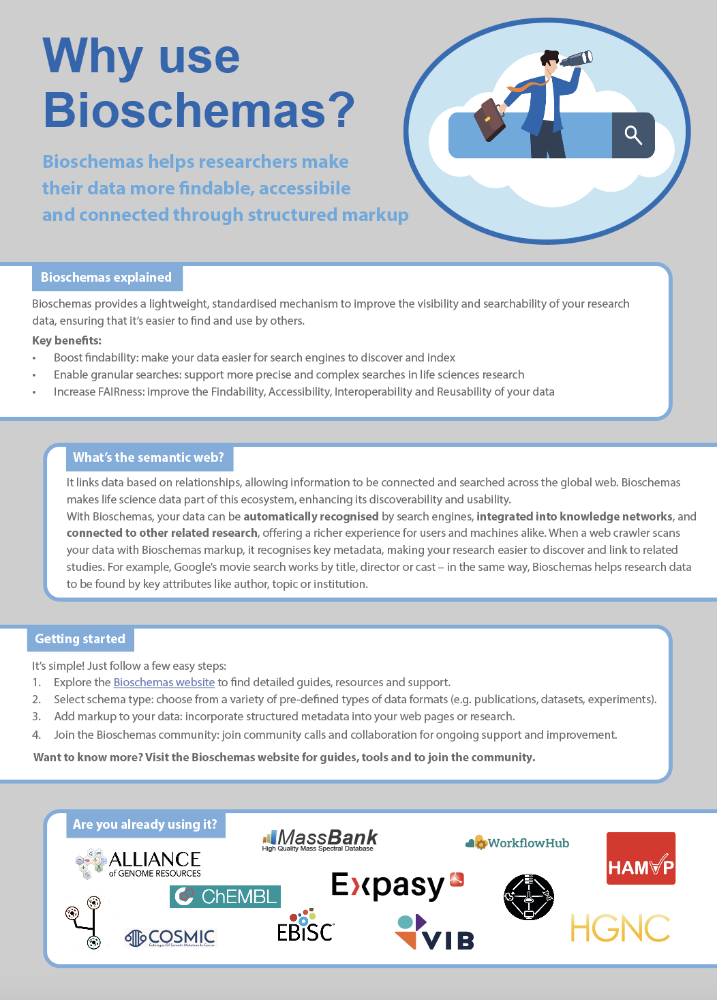
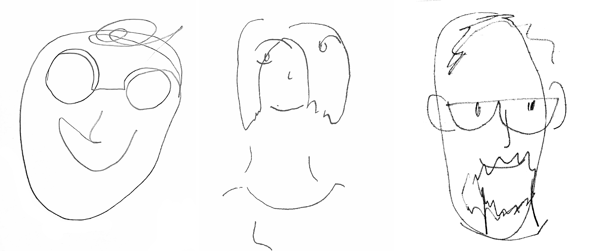
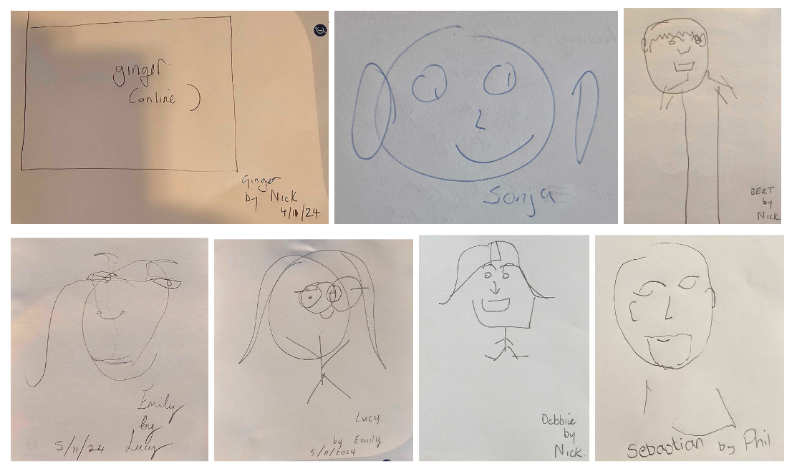

# Introduction

Bioschemas is a community effort [@citesAsAuthority:Gray2023] to improve the FAIRness [@citesAsAuthority:Wilkinson2016] of web-based resources. Established by ELIXIR over seven years ago, it is relatively well adopted by technical communities exemplified in workflows, software, and tools [@citesForInformation:Castro2023;  @citesForInformation:Rosinach2023; @citesForInformation:Arend2024; @citesForInformation:Soiland-Reyes2024] but less so for communities such as training or even data services.

The Bioschemas website hosts tooling, training and guidance materials. Largely, guidance is at a technical level — written by techies for techies — making it inappropriate or inaccessible for a large cohort of potential Bioschemas users. Practical ‘how to use Bioschemas’ help and examples have been neglected. Furthermore, examples focus on simple use cases and not real set-ups that users actually encounter in their work. This makes access to directly usable markup impossible, leaving users confused about where to go next. This lack of helpful support poses an unacceptably high technical barrier for the broader user community and means Bioschemas is not being fully exploited. Common complaints frequently cited include there being a technical ‘barrier’, lack of ‘lightweight’ guidance, the need to ‘demystify’ and the lack of assistance to users who have the desire to implement Bioschemas, but not the ‘how’ this can be accomplished.

The goal of this project is to reimagine, reframe and supplement the existing Bioschemas guidance available. Working with non-technical users from the data and training platforms, we identified patterns of use, commonly undertaken tasks (including use of different content management systems (CMS) and on user personas and roles. This information will be used to identify what is needed by less technical users, ultimately providing specific code examples that can be copy/pasted, documented examples for different web setups, customised guidance for different personas, and to address usability and content accessibility. The materials provided through this longer term goal will be validated by non-technical users, starting with relevant ELIXIR stakeholders.

# Task 1: Analytics

Google Analytics information was captured from July to November 2024 (and is ongoing). Data was captured and analysed over this period in an effort to ascertain user behaviour, including sessions, location of originating request, transitions, pages accessed, view time (engagement), landing page (page session started), and source (direct, organic search and referral). 

## Main outcomes

Roughly 33% of visits from users arriving from ‘direct’ routes (bookmark or web link) resulted in ‘engaged’ sessions, while almost 50% engagement was seen when using ‘referral’ links.

Large numbers of visits were to ‘Training’ related pages, which we believe are a result of current work in those areas, for example, the ELIXIR Training Platform is currently developing [guidance on how to mark up training materials](https://elixir-europe-training.github.io/ELIXIR-TrP-Bioschemas/) so they can be discovered by the [ELIXIR TeSS](https://tess.elixir-europe.org/about) (Training eSupport System) portal.

We note that some ‘help’ URLs were highly accessed, including ‘/tutorials/howto/…’ on ‘bioschemas’, ‘add markup’, and ‘add github’. We excluded such links which were explainable as ‘noise’ in the context of this work. We conclude that help pages are among those most visited, after excluding explainable phenomena. 

## Next steps

We will continue to collect analytics information going forward, to identify whether changes made in the webpages/organisation of materials and their availability impact the findability and usability of the guidance. This may manifest as  increased engagement times on those pages, for example. (Appendix A.1).

There appears to be a clear need, supported by other tasks in this work, especially user stories, suggesting that more general guidance is needed. 

Further analysis of the analytics could be undertaken to understand the needs or guidance viewed on a national level, for instance, whether there are regional differences in the needs in Germany versus those in the UK.

Several tutorials and pages about community engagement are not discoverable because they do not appear in the menu. More is required to expose all available support in a systematic way. 

While we attempt to evaluate the conversions (where there is a concrete action that is the result of having viewed some page), at best we can only approximate what this would manifest as, in the context of guidance/tutorials. There may, with sufficient information, be a way to see, for example, whether some guidance specifying the use of GitHub corresponded to some GitHub commits. We could also look further to delineate between new users and returning users. 

# Task 2: User Stories
To classify the tasks and objectives of our users’ needs related to Bioschemas, we decided to collect ‘User Stories’, in the form: \
As a `<persona>` I want to `<task>` so that `<objective>`.

We proposed a set of personas in advance and supplemented these as we moved through the exercise with different participants.
The set of personas we created in advance were: Data steward, Developer, Researcher, Manager, and Trainer. These were supplemented with ‘Systems Administrator’ and ‘Explorer’.

## Main outcomes
These stories were [collected through Miro](https://github.com/PhilReedData/bioschemas-for-mortals/blob/main/paper/miro-board-export.pdf),  and the original set, organised by Persona, are shown in Appendix 2.1. To analyse this information further, we clustered it (Appendix 2.2). This provides a way to organise the tasks into whether they are ‘inward’ facing or ‘external’ facing (for instance a developer may be internally organising Bioschemas for their source, or externally looking to harvest available markup outside of their control). We also identified possible knowledge paths, which could be likened to ‘[Learning Paths](https://elixir-europe.org/internal-projects/commissioned-services/learning-paths-2018)’. This could be used as a way to direct users to sequential guidance towards their objective, in terms of Bioschemas implementation. We note also that there are also objectives that are shared between personas, and tasks common across them.

To support the collection of user stories, we also hosted an online zoom drop in (Task 3). This provided us valuable information on user experiences in using Bioschemas, as well as indicating specific guidance that was missing. Examples of this include general guidance on metadata, guidance on what Bioschemas is useful for, and the difference between ‘Types’ and ‘Profiles’. We did find this information on the website, but it is not easy to locate. (see also Task 7 - UX/UI). A high level ‘infographic’ was also suggested by multiple participants as being highly desirable. We spun this off as Task 8.

## Next steps

Using the clustering, we will be able to correctly annotate new and existing guidance as being appropriate to particular personas, taking into consideration those common tasks.  The ‘arrow’ in the ‘explorer’ persona (Appendix 2.2) could be expressed as a learning path, where an ‘explorer’ visits first to get general knowledge of metadata/schemas, moves further with knowledge of ‘bioschemas’, and eventually becomes proficient enough to ‘champion’ Bioschemas usage.

# Task 3: Drop in session to facilitate Task 2

A drop-in session was scheduled in the middle of the week, inviting Bioschemas users from outside the hackathon pool of participants to provide a [focused set of contributions](https://github.com/PhilReedData/bioschemas-for-mortals/blob/main/paper/miro-board-export.pdf). We looked at the user stories, landscape and website accessibility. The discoveries were formally captured within the work of Task 2.

Interested readers are invited to contribute to this ongoing process by [completing the survey](https://bit.ly/bh2410s). 

# Task 4: Assets

While the Bioschemas website does provide help and guidance, it is somewhat scattered, poorly ‘labelled’, and hard to find. To exacerbate this issue, the site itself does not have a search function (see also UX/UI, Task 7). This task was undertaken to document what guidance and help is available on the site, where it is located, whether it is accurate, and whether it is accessible through the menus (in particular, the top navigation bar and its drop down menus). Such activity is necessary to determine which guidance is already written, but hard to find, versus which documentation itself is missing. To execute this task, we started with the GitHub pages and matched ‘raw’ content (in GitHub) to its location on the Bioschemas (live web) site.

## Main outcomes

The [register](https://docs.google.com/spreadsheets/d/1pjHv7oKqt-RDcIWIL3r0MNISLj2JHRSL/edit?gid=1406033492#gid=1406033492) of assets includes documentation (by type), whether up to date, for materials both internal and available through some key external resources such TeSS and Zenodo. Some of the information here also ties into the web interface and usability of Bioschemas (Task 7).

1. Use cases that may be useful to users are only available from the specifications section of the website, specifically for [profiles](https://bioschemas.org/profiles/), but not [types](https://bioschemas.org/types/). The page dedicated to use cases (under live deploys) is not on the menu, and not all use cases are linked from the profiles pages. 
2. Linked ‘examples’ from profiles page list point to a [second GitHub repository](https://github.com/BioSchemas/specifications) with no further guidance, while within a specific profile, they provide a pop up image example (3).
3. Profiles have pop up examples (images), but others are from a GitHub repository (2).
4. Can reach use cases from profile by the links tab \- could be clearer.
5. Could use more examples.  
6. Table with black/blue on the tables is an accessibility issue (See Task 7 for more about accessibility issues).

As a preliminary and concrete outcome of this task, we identified that no guidance for the only supported Bioschemas markup generator was available. This has now been [drafted](https://docs.google.com/document/d/1-NxWpJynnKoq4muF-3gE464zLxgzBJPAA4jBo7GY6B8/edit?tab=t.0), and will appear on the website once finalised. 

## Next steps

This information can be used in other tasks. Firstly, further work is required to organise the available materials logically, facilitating its accessibility through the web interface/search functions. This in of itself may help identify missing guidance. Secondly, this can be cross-referenced with what guidance and which type of guidance the different personas require. For example, a tutorial about markup for implementing bioschemas in github, versus a code example for a particular profile to implement in a web page. Thirdly, we can also check whether the guidance is up to date.

# Task 5: Guide to using markup generator

This task was undertaken as a sub-task of Task 4, and has been completed.

# Task 6: Governance for contributions

There exists [governance documentation](https://github.com/BioSchemas/governance/tree/master) for community contributions to profiles and types. However, it does not cover contributions to guidelines and documentation, which may be written by a wider set of personas, including those with less technical experience or expertise. Task 6 seeks to fill this gap, proposing additional governance for guidelines and documentation contributions. This task was deprioritised and will be revisited when possible. This would describe how users can contribute to missing guidance, help in its review, and would include for example the provision of templates to facilitate submissions.

Currently, there are two ways of contributing. Contributors can either submit their work via Google Docs or directly through GitHub, with the latter being the preferred option for the convenience of the editors.

It is crucial to determine who will handle the review process, ensuring the materials align with our guidelines, serve the intended purpose, and are thoroughly tested.   
Any recommendations will need to be formally presented to the Bioschemas steering group for approval.

We need to clarify our objectives and provide contributors with general guidance on suitable content for submission. We might consider developing one or more templates to support this, which can then be presented to the committee. Templates may vary based on the type of contribution—examples include summaries, step-by-step guides, and overviews.

Current priorities: 

1. Our primary focus is on creating a step-by-step guide for implementing Bioschemas with content management systems (CMS). At this stage, we have one approach documented on GitHub using Jekyll.  
2. Introducing Bioschemas: For non-technical contributors, we should provide a general introduction to Bioschemas, including an overview of metadata and some descriptive guidance that doesn’t require coding.

# Task 7: UX/UI

The main point of entry to help for Bioschemas is surfaced as the Bioschemas website. This was examined with respect to usability and interface aspects, with the aim to provide feedback to the Bioschemas Steering committee to identify improvements that could be made in both short and long term. 

## Main outcomes

We have created a list of improvements that could be made to the website to facilitate users’ needs in finding appropriate guidance for their particular persona. While the implementation of a ‘persona’ based search, or a decision tree based drill down tool to select appropriate guidance (as with Data Stewardship Wizard) may be worthy long term goals, shorter term implementations, such as a search button, should be easy to implement. Prioritisation is suggested using MoSCoW labels (must-have, should-have, could-have, will-not-have). The list of suggestions is shown below (Tables 1 through 4).

After discussion on the technical effort required in implementing all requests listed in Tables 1 through 4, consideration must be given to whether a re-implementation may be less resource-intensive. Implementation of requested features should be mindful of differing expertise levels with the existing infrastructure (1 week for an informed expert, versus 1 month for someone unfamiliar with the subject).

Table 1: New features to Bioschemas website proposed

| Summary | Priority; Difficulty | Comment |
| :---- | :---- | :---- |
| Show the current page in the menu. | Must-have; Low | Could lift from [ETT](https://github.com/ELIXIR-Belgium/elixir-toolkit-theme) |
| Search the site. | Must-have; Medium  | Could lift from ETT |
| Faceted search. | Could-have; Hard  |  |
| Fly-out submenu navigation, and review navigation content. | Should-have; Medium   | Bootstrap examples |
| Make a form for ‘propose new type’ instead of an email address. | Low; Could-have | Could lift from RDMkit |
| Breadcrumbs. | Must-have; Medium  | Easier to manually add to metadata on each page |

Table 2: Improvements to Bioschemas website proposed

| Summary | Priority; Difficulty | Comment |
| :---- | :---- | :---- |
| Make titles closer match between page titles, heading and menu links. | Must-have; Low |  |
| Full review of content, URLs, names, language. | Should-have; Hard |  |
| Direct people to the profiles vs types description, make it obvious. | Must-have; Very low | Add heading within that page, link to it |
| Simplify the group creation process. | Could-have; Hard | For discussion with Steering group |
| Harmonise where the menus are; don't bury links to help inside paragraphs \- if its the only way to reach it. | Should-have; Hard |  |
| Make desktop view wider to accommodate left side menu. | Could-have; Hard | Need mobile view to have equivalent |

Table 3: New content for Bioschemas website proposed

| Summary | Priority; Difficulty | Comment |
| :---- | :---- | :---- |
| Infographic why to use Bioschemas for mortals. | Must-have; Medium | See Task 8, could go on home or about page somewhere |
| Visualisation of what is a profile and what is a type. | Should-have; Medium | Could be a decision tree or other graphic |
| Contribution guide for content writers. | Must-have; Medium | Part of Task 6 |
| Contribution guide for web developers.  | Must-have; Medium | README file, how to properly use Bootstrap, CSS/JS |
| Give more description on the Properties page. | Should-have; Medium |  |

Table 4: Accessibility considerations for Bioschemas website proposed

| Summary | Priority; Difficulty | Comment |
| :---- | :---- | :---- |
| Use accessibility tools to thoroughly check site.  | Must-have; Hard | Eg [WAVE](https://wave.webaim.org/)  |
| Improve colours of properties links in the Profiles table, eg remove ‘visited’ colour change. | Should-have; Easy | Uses colour alone to convey info, but it’s an inherited problem from Schema.org |
| Add ARIA markup, especially on the Profiles table, so links can be distinguished by screen readers. | Should-have; Medium | Identify other places where this is needed |

# Task 8: Infographic

Multiple participants across our activities stated their desire to have a high level infographic to serve as an entry point for Bioschemas. Currently, we are soliciting ideas on how to express the concepts we wish to convey, and on what level of detail.

## Main outcomes

The infographic could convey: 

* What is Bioschemas?  
* Why bother with markup?  
* What is the semantic web?  
* What's the difference between types and profiles?  
* How do I find out more?

In a short brainstorming session we have drafted one panel (or a 3 or 4 panel infographic) (Appendix 8.1). This showcases the concept ‘cloud’ (the internet/www), which conveys the totality of the internet and interconnectedness of resources. The ‘you’, as the user being central in the ‘cloud’, and an integral agent in this ecosystem, reflected by a central positioning in the infographic. To demonstrate the ‘relationship’ between user and internet, and to build this familiarity into the infographic, we rely on the user self-identifying through the  ‘collection’ of logos in the image. This logo collection will be taken from the logos of the resources listed in the live ‘deploys’ pages of Bioschemas, with the objective to cast the user into a familiar environment through visual association with those logos.

## Next steps

More work is needed to converge upon the remaining ‘panels’ for the infographic. This can be undertaken in a community exercise, possibly on the bioschemas community call.

# Conclusions

Over the course of the hackathon, we identified multiple issues that should be addressed to help less technical Bioschemas users, We gained valuable insights into their typical tasks and interactions with the website. We have broken down the issues into concrete tasks, with initial plans by which to proceed. The ‘hackathon’ enabled us to work with numerous interested parties and work on multiple tasks simultaneously; this format seems particularly well-suited to the type of interactive work required.

For each of the tasks identified above, we have documented the progress made at the hackathon, and the next steps. This ‘backlog’  has already been highlighted to the Bioschemas Steering Committee, and has been actioned; a dedicated hackathon has been planned. Following this event, we will begin planning the next ELIXIR biohackathon proposal, which will continue the work we started here, but with ‘developer’ assistance to implement solutions. The precise details will be fleshed out in the coming weeks.

Bioschemas is currently an important but under-utilised metadata ‘interconnection’ mechanism through which ELIXIR resources, tools and services can be linked. Once these links are applied more systematically and comprehensively, one can look more broadly at connections to other related resources in other e-Infrastructures. To facilitate this wider approach, and to avoid ‘bio’-focused biases which exist in other domains, precluding Bioschemas usage, there is a need to provide equivalent means to develop and support users in other schemas. For this reason, Bioschemas has developed a ‘sister’ site to host such schemas: Schemas.sci. Here, it is envisioned that domain-agnostic, and non-’bio’ schemas could be shared, enabling multi-disciplinary linking of resources for the benefit of research, on an open community platform. For this reason, we will also use the learnings from the Bioschemas hackathons to progress more quickly on the schemas.sci site.

# Acknowledgements

- Led by: Nick Juty, Helena Schnitzer, Phil Reed
- Participants (on site): Bert Droesbeke, Emily Knight, Lucy Pelton, Deborah van Wyk
- Online: Leyla Jael Castro, Munazah Andrabi, Ulrike Wittig, Finn Bacall, Ginger Tseung
- Interactions with other groups: \#[24](https://github.com/elixir-europe/biohackathon-projects-2024/blob/main/24.md), \#[21](https://github.com/elixir-europe/biohackathon-projects-2024/blob/main/21.md) 
- Project Repository: https://github.com/elixir-europe/biohackathon-projects-2024/blob/main/10.md

We also acknowledge the contributions of project participants for our icebreaker activity, where participants drew a colleague with their eyes shut (Appendix B).

Supported by ELIXIR, the research infrastructure for life science data, this work was carried out as part of the ELIXIR Biohackathon Europe.

# Appendices

## Appendix A1

## Appendix A2.1

## Appendix A2.2

## Appendix A7

## Appendix A8.1

## Appendix A8.2

## Appendix B

# References
